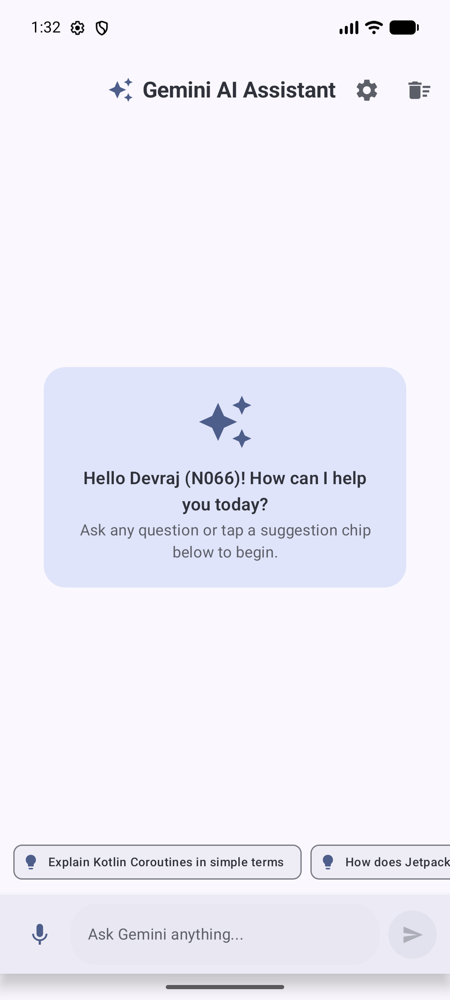
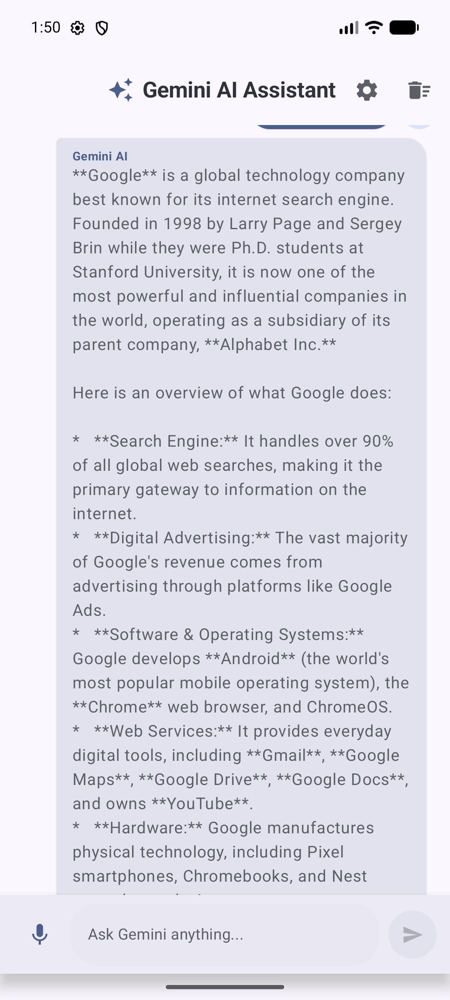

# Gemini API Compose Starter

## Summary
Implemented the Gemini chat assignment using Kotlin and Jetpack Compose for Devraj Murari (N066).

## Features
- Material 3 chat bubbles with LazyColumn, stable IDs, and auto-scroll.
- StateFlow-based ViewModel and lifecycle-aware state collection (`collectAsStateWithLifecycle`).
- Adaptive layout using WindowSizeClass for compact and expanded displays.
- Loading indicators, input validation, and error states.
- Voice input modality using Android RecognizerIntent.
- Preferences DataStore for customizable system prompt and temperature settings.
- Persistent conversation history surviving process recreation and app restarts.
- Quick prompt suggestion chips for rapid interaction.

## API-Key Handling
- Local configuration in `local.properties` with environment-variable fallback for CI.
- Placeholder template in `local.properties.example`.
- Hardware-backed AES-256-GCM encryption using Android Keystore.
- Plaintext API key decrypted strictly in-memory upon GenerativeModel creation.
- Release build obfuscation enabled via R8 (`isMinifyEnabled = true`).

## Know the Limits (Production Security Analysis)
Client-side encryption raises the bar against static analysis but cannot fully conceal an API key from a determined attacker on a rooted device using dynamic instrumentation (e.g., Frida or Xposed). In a production deployment:
1. Gemini API calls should be routed through a backend proxy server (such as Ktor, Cloud Functions, or Cloud Run).
2. The backend server manages user authentication and securely accesses the API key via Google Cloud Secret Manager.
3. Requests from the Android client are validated using Firebase App Check and Google Play Integrity.

## Verification & Testing
- Unit tests: `./gradlew testDebugUnitTest` (All tests passed)
- Debug APK build: `./gradlew assembleDebug`
- Verified live response execution on Android Emulator (Pixel 8, API 37.1) using `gemini-3.6-flash`.
- Verified local offline persistence, system prompt customization, and history clearing.

## Setup Instructions
1. Obtain an API key from Google AI Studio.
2. Copy `local.properties.example` to `local.properties`.
3. Add your key:
   ```properties
   GEMINI_API_KEY=your_actual_api_key_here
   ```
4. Build and test the project:
   ```bash
   ./gradlew testDebugUnitTest
   ./gradlew installDebug
   ```

## Screenshots

### Welcome Screen & Suggestion Chips


### Live AI Conversation


### Assistant Preferences & Temperature Settings

