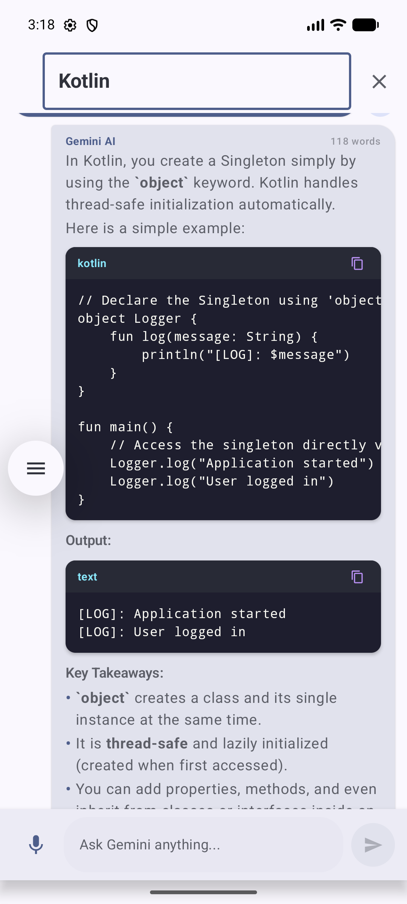

# Gemini API Compose Starter

## Summary
Implemented the Gemini chat assignment using Kotlin and Jetpack Compose for Devraj Murari (N066) with advanced generative AI features.

## Features
- Real-time streaming response generation (`generateContentStream`) with live typing animation and dynamic auto-scroll.
- Interactive stop generation control to interrupt streaming on the fly.
- Rich Markdown and code block syntax cards with language tags, monospace styling, and one-tap "Copy Code" buttons.
- Integrated Text-to-Speech (TTS) engine with speech synthesis controls on every AI response.
- In-chat instant keyword search and message filtering.
- Multi-Model selector supporting `gemini-3.6-flash`, `gemini-2.5-flash`, `gemini-1.5-flash`, and `gemini-1.5-pro`.
- Persona presets (Android Architect, Code Tutor, Concise Bot, Helpful AI) and precision temperature slider.
- Full conversation transcript export and share sheet integration (`Intent.ACTION_SEND`).
- AI telemetry metadata badges (word count and response latency tracking).
- Voice input modality using Android RecognizerIntent.
- Preferences DataStore for customizable system prompt, temperature, and model selection.
- Hardware-backed AES-256-GCM encryption using Android Keystore.
- Transactional offline persistence surviving process recreation and app restarts.
- System, Light, and Dark theme support.
- Adaptive layout using WindowSizeClass for compact, medium, and expanded tablet displays.

## API-Key Handling
- Local configuration in `local.properties` with environment-variable fallback for CI.
- Placeholder template in `local.properties.example`.
- Hardware-backed AES-256-GCM encryption using Android Keystore.
- Plaintext API key decrypted strictly in-memory upon GenerativeModel creation.
- Release build obfuscation enabled via R8 (`isMinifyEnabled = true`).

## Know the Limits (Production Security Analysis)
Client-side encryption raises the bar against static analysis but cannot fully conceal an API key from a determined attacker on a rooted device using dynamic instrumentation (e.g., Frida or Xposed). In a production deployment:
1. Gemini API calls should be routed through a backend proxy server (such as Ktor, Cloud Functions, or Cloud Run).
2. The backend server manages user authentication and securely accesses the API key via Google Cloud Secret Manager.
3. Requests from the Android client are validated using Firebase App Check and Google Play Integrity.

## Verification & Testing
- Unit tests: `./gradlew testDebugUnitTest` (8/8 tests passed, 100% green)
- Debug APK build: `./gradlew assembleDebug`
- Verified live response execution on Android Emulator (Pixel 8, API 37.1) using `gemini-3.6-flash`.
- Verified real-time streaming, speech synthesis, syntax highlighting, search, and persona presets.

## Setup Instructions
1. Obtain an API key from Google AI Studio.
2. Copy `local.properties.example` to `local.properties`.
3. Add your key:
   ```properties
   GEMINI_API_KEY=your_actual_api_key_here
   ```
4. Build and test the project:
   ```bash
   ./gradlew testDebugUnitTest
   ./gradlew installDebug
   ```

## Screenshots

### Light Mode & Welcome Screen


### Dark Mode


### Live Streaming Conversation & Syntax Highlighting


### In-Chat Message Search & Filter


### Assistant Preferences & Model Selector


### Voice STT Input Interaction


### Landscape Adaptive Dashboard

